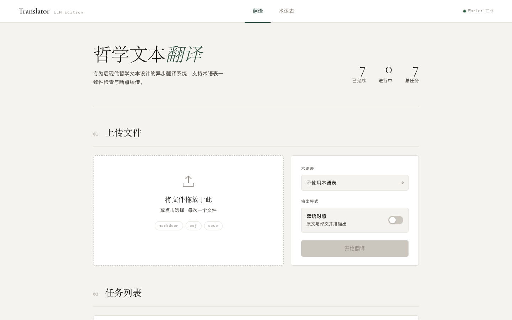

# agentic-translator

**面向高密度、术语繁重的书籍与论文的 Agentic 翻译系统 —— 输入 PDF/EPUB/Markdown，输出可直接出版的中文 Markdown。**

不绑定单一领域：自定义一份术语表，即可翻译任何让朴素"切块 + Prompt"方式失效的专业文本 —— 后现代哲学（Nick Land 的 CCRU 著作、Reza Negarestani 的《Cyclonopedia》）、机器学习论文，以及任何在 300+ 个块之间绝不容许术语漂移的场景。

[](https://github.com/sena1818/agentic-translator/actions/workflows/ci.yml)
[](LICENSE)
[](https://www.python.org/downloads/)

[English](README.md) | **简体中文**



## 为什么是 Agentic？

单条 Prompt 装不下一整本书。本系统把工作拆给三个 LLM 角色，由**文档级 LangGraph StateGraph** 统一编排：

- **分析员（Analyst）** —— 通读全文一次，产出全局文档画像（摘要、风格、术语提示），注入每个块的翻译 Prompt。
- **翻译员（Translator）** —— 并发翻译每个块，受术语表与文档画像双重约束。
- **审校员（Reviewer）** —— *只*对质检不通过的块介入（未翻译残留、术语遗漏、Markdown 结构损坏），成本与风险成正比。

这套架构是否真的有效，由可复现的[评测体系](#评测)回答 —— 包括一个由数据驱动的"**不做** RAG 翻译记忆"的决策（[ADR-0002](docs/adr/0002-rag-translation-memory-threshold.md)）。

## 核心特性

- 🕸️ **文档级 LangGraph 引擎** —— 分析员 → Send API fan-out → 逐块翻译/质检/修复 → 汇总，全部建在一张 StateGraph 里（[ADR-0001](docs/adr/0001-langgraph-document-level-graph.md)）；`native` asyncio 引擎保留在配置开关后面用于 A/B 对照
- 🚀 **异步并发** —— 可配置并发数 + Token Bucket 限流 + 指数退避重试
- 🧩 **章节感知分块** —— 沿 Markdown 标题规划 chunk，携带稳定的结构化 chunk ID
- 📚 **术语表强约束** —— JSON 术语表注入 Prompt，并由质检器校验一致性
- 🛡️ **选择性修复** —— 质检标记高风险块，只有这些块触发审校员一次性重译
- 💾 **Chunk 级 SQLite 缓存** —— 天然支持断点续传；缓存键包含模型、术语表、Prompt 版本与文档画像指纹
- ⚠️ **失败隔离** —— 单块失败写入占位符，绝不阻塞整个文档
- 🌗 **双语对照导出** —— 原文/译文交替 Markdown 与双栏 HTML
- 🌐 **Web 管理界面** —— React + FastAPI，SQLite 任务队列，worker 可横向扩展
- 🔌 **MCP Server** —— stdio 传输，把翻译、任务管理、术语表工具暴露给 Claude Desktop 等 MCP 客户端
- 🔭 **可观测性** —— 可选接入 Langfuse，追踪完整 Agent 调用链与逐块 token 消耗，未配置时自动降级为无操作

## 快速开始（Docker）

无需本地 Python / Node，一条命令拉起前端 + API + worker：

```bash
git clone https://github.com/sena1818/agentic-translator.git
cd agentic-translator

# 1. 配置密钥
cp .env.example .env      # 然后填入真实的 SILICONFLOW_API_KEY

# 2. 构建并启动全套服务
docker compose up --build

# 3. 打开浏览器
#    Web 界面: http://localhost:8000
#    API 文档: http://localhost:8000/docs
```

**api** 服务对外提供 Web 界面与 REST API，**worker** 服务独立消费翻译队列，两者共用同一镜像。任务库、翻译缓存、上传文件与结果全部落在命名数据卷（`translator-data` / `translator-logs`），`docker compose down` 后再 `up` 数据不丢；彻底清空用 `down -v`。

## 快速开始（本地）

```bash
git clone https://github.com/sena1818/agentic-translator.git
cd agentic-translator
pip install -r requirements.txt
cp .env.example .env      # 填入 SILICONFLOW_API_KEY

# 翻译 Markdown 文件
python translate.py data/input/book.md

# EPUB + 术语表 + 自定义输出路径
python translate.py BookTrans/Cyclonopedia.epub \
  -g data/glossaries/CPglossary.json \
  -o output_final/Cyclonopedia_CN.md

# 双语对照输出
python translate.py data/input/book.md --bilingual --skip-conversion
```

本地跑 Web 界面：

```bash
python run_server.py           # API + 内联 worker，:8000
# 可选的前端开发服务器：
cd frontend && npm install && npm run dev   # Vite，:5173
```

长任务建议把 API 和 worker 拆开：

```bash
TRANSLATION_INLINE_WORKER=0 python run_server.py      # 终端 1：只启动 API
python run_worker.py --processes 4 --parallel-tasks 2  # 终端 2：worker 集群
# 或 macOS 下：bash scripts/longrun.sh                 # 后台 API + worker + PID/日志文件
```

## 架构

### 分层结构

```
┌────────────────────────── 入口层 ──────────────────────────┐
│  translate.py (CLI)   src/api (FastAPI + worker)           │
│  src/interfaces/mcp (MCP stdio server)                     │
├────────────────────────── 流水线 ──────────────────────────┤
│  src/pipelines: ingest → preprocess → translate →          │
│  postprocess。translate/ 内含两个引擎：                     │
│    graph_engine.py（LangGraph，默认）                       │
│    batch_orchestrator.py（native asyncio，过渡期保留）      │
│  两者共用：prompt_builder / translation_client /            │
│  quality_pipeline / document_analyzer                      │
├──────────────────────── 领域与核心 ─────────────────────────┤
│  src/domain: models、contracts、rules（纯逻辑，无 I/O）      │
│  src/core: chunk_planner、translation_cache、rate_limiter、 │
│            output_manager（顺序流式写盘）、validator         │
├──────────────────────── 基础设施 ──────────────────────────┤
│  src/infrastructure: llm（模型工厂）、cache、persistence、   │
│  converters（Pandoc）、observability（Langfuse）、config、   │
│  filesystem                                                │
├────────────────────────── 评测 ────────────────────────────┤
│  src/evaluation: translator-eval CLI —— LLM-as-judge、      │
│  两两对照、译法一致率指标                                    │
└────────────────────────────────────────────────────────────┘
```

### LangGraph 文档图

```
        START
          │
      ┌───▼────┐   文档画像：摘要 / 风格 / 术语提示
      │analyze │   （分析员角色）
      └───┬────┘
          │  Send API fan-out —— 每个 chunk 一个分支
   ┌──────┼─────────┬─ ··· ─┐
┌──▼───┐ ┌▼─────┐ ┌─▼────┐
│transl│ │transl│ │transl│   每个分支：翻译 → 质检
│ate #0│ │ate #1│ │ate #N│   →（不过？）审校修复 → 复检
└──┬───┘ └┬─────┘ └─┬────┘   最终失败收敛为占位符
   └──────┼─────────┴────┘
      ┌───▼─────┐  只做统计 —— 各块已由 OutputManager
      │aggregate│  按原文顺序流式落盘
      └───┬─────┘
         END
```

几个值得一提的设计决策（完整论证见 [ADR-0001](docs/adr/0001-langgraph-document-level-graph.md)）：

- **不用 LangGraph checkpointer** —— 断点恢复由 chunk 级 SQLite 缓存承担，图状态持久化与其职责重叠。
- **顺序流式写盘扛得住崩溃** —— 块按原文顺序边完成边落盘，翻到一半崩了也能留下可读的半成品。
- **引擎开关** —— [config/config.yaml](config/config.yaml) 中 `multi_agent.engine: langgraph | native`；两条路径共用同一批组件，并由引擎等价性测试套件保证行为一致，直至 `native` 被删除。

## 评测

`translator-eval` 跑三组对照 —— 每组只在生产基线（LangGraph + 多 Agent 开 + 术语表有）上拨动一个开关：

| 对照组 | 变体 A | 变体 B |
| --- | --- | --- |
| 编排引擎 | LangGraph | native asyncio |
| 多 Agent 协作 | 开 | 关（仅翻译员） |
| 术语表 | 有 | 无 |

- **裁判**：Gemini（刻意与选手 DeepSeek 异源，规避同源偏好），按准确性 / 流畅度 / 术语一致性三维 1–5 分打分。裁判 Prompt 版本化保存在 [docs/evals/judge_prompt.md](docs/evals/judge_prompt.md)。
- **译法一致率指标**：度量术语表外的重复短语跨块译法是否一致，作为"要不要立项 RAG 翻译记忆"的量化门槛 —— 阈值 0.90，决策记录在 [ADR-0002](docs/adr/0002-rag-translation-memory-threshold.md)。
- **复现**：`translator-eval --out docs/evals/results`（需 `SILICONFLOW_API_KEY` + `GOOGLE_API_KEY`）；`--dry-run` 用假模型冒烟验证评测框架本身。

方法论、数据集与最新报告在 [docs/evals/](docs/evals/methodology.md)。当前提交的报告为 `--dry-run` 冒烟结果（占位分数），补齐裁判/选手密钥跑完整套件后即回填真实数据。

真实生产运行的吞吐（Ccru.md，344 块，并发 10）：**端到端约 25 分钟，13.8 chunks/分钟，344/344 全部成功**。

## MCP Server

把整个系统以 12 个工具的形式暴露给 Claude Desktop（或任意 MCP 客户端）—— 短文本即时翻译、异步文档任务、完整术语表 CRUD，走 stdio 传输。在 `claude_desktop_config.json` 中添加：

```json
{
  "mcpServers": {
    "agentic-translator": {
      "command": "python",
      "args": ["-m", "src.interfaces.mcp.server"],
      "cwd": "/absolute/path/to/agentic-translator",
      "env": { "SILICONFLOW_API_KEY": "sk-your-key-here" }
    }
  }
}
```

工具清单、典型工作流与取消语义：[docs/mcp-server.md](docs/mcp-server.md)。

## 可观测性

可选接入 Langfuse，追踪分析员 / 翻译员 / 审校员的完整调用链与逐块 token 消耗。在 [config/config.yaml](config/config.yaml) 中开启并设置 `LANGFUSE_PUBLIC_KEY` / `LANGFUSE_SECRET_KEY`；任一缺失即降级为无操作并打印 warning —— 流水线永远不依赖它。详见 [docs/observability.md](docs/observability.md)。

## 配置

全部配置在 [config/config.yaml](config/config.yaml)。真正常用的几个开关：

```yaml
api:
  model: "deepseek-ai/DeepSeek-V3"
  translator:
    temperature: 0.3

concurrency:
  max_concurrent_requests: 10   # 遇到 429 就降到 5
  rate_limit_per_minute: 200

multi_agent:
  enabled: true
  engine: "langgraph"           # langgraph | native（ADR-0001）

observability:
  langfuse:
    enabled: false
```

## 术语表

英文术语 → 中文译名的 JSON 映射，强制注入 Prompt 并由质检校验：

```json
{
  "Hyperstition": "超虚构 (Hyperstition)",
  "War Machine": "战争机器 (War Machine)"
}
```

命令行用 `-g data/glossaries/my_glossary.json` 指定，也可在 Web 界面可视化管理，或通过 MCP 工具增删。

## 开发

```bash
pip install -e ".[dev]"   # 或 pip install -r requirements.txt
ruff check .              # lint
pytest                    # 单元 + 集成测试
```

CI 在每次 push 时运行 Ruff、pytest 与前端构建（[ci.yml](.github/workflows/ci.yml)）。

更多文档：[CONTEXT.md](CONTEXT.md)（领域词汇表）· [docs/adr/](docs/adr/)（架构决策记录）· [docs/guides/](docs/guides/)（使用指南）。

## 许可证

MIT —— 见 [LICENSE](LICENSE)。
